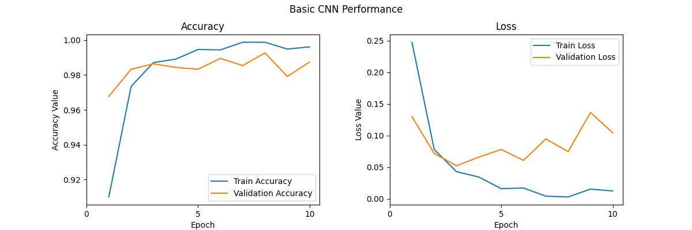
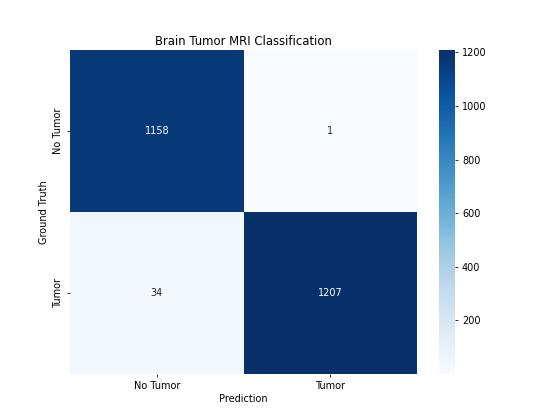
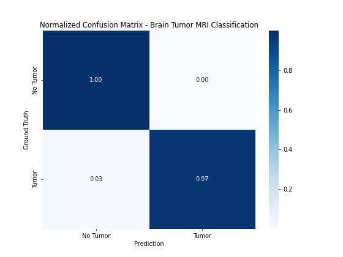
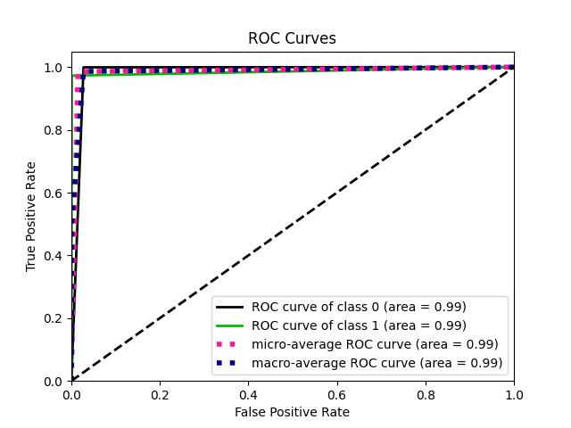
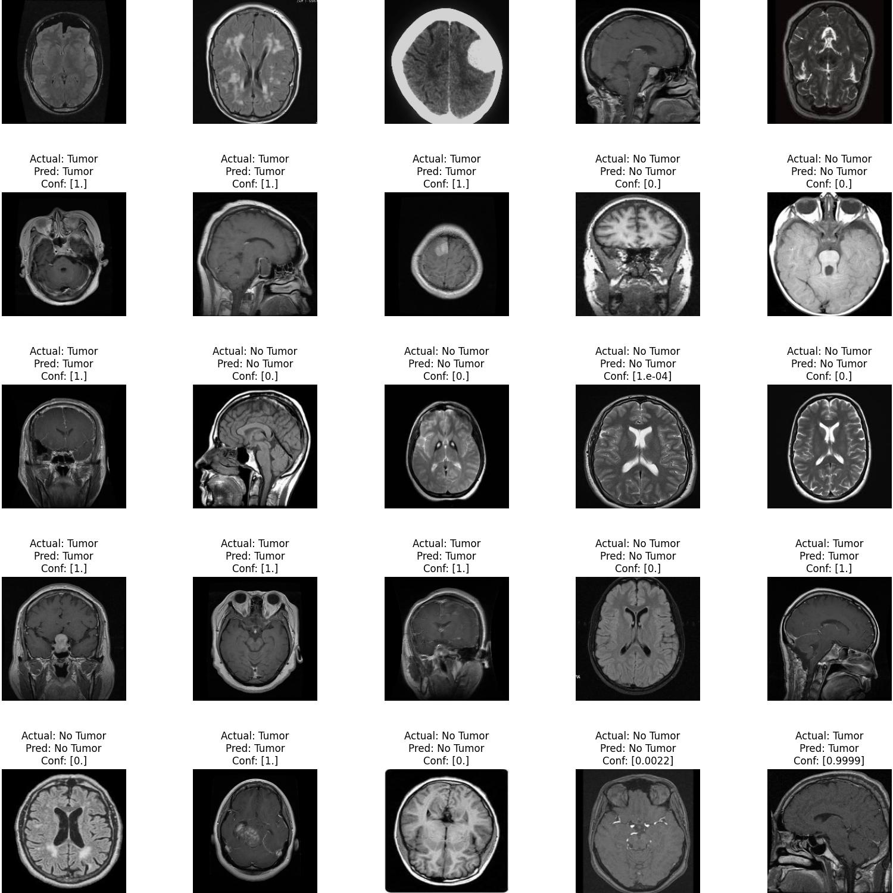

# Brain Tumor Classification

*Self Learning Project by*

**Siddhant Chourasia**

B.Tech | Electrical Engineering | IIT Bombay

---


## Overview

This project focuses on developing a brain tumor classification model using deep learning techniques to analyze brain MRI images. The dataset initially contained four classes: glioma, pituitary, meningioma, and no tumor. However, for simplicity, the three tumor classes were merged into a single 'tumor' class, while the 'no-tumor' class remained unchanged.

Data augmentation techniques, such as flipping and cropping, were applied to increase the training dataset's diversity and prevent overfitting. The model architecture is based on a Convolutional Neural Network (CNN) with convolutional layers, max-pooling layers, and fully connected layers for binary classification.

After training the model, its performance was evaluated on a separate test set, and metrics like accuracy, precision, recall, and F1-score were calculated. The project aims to enhance medical image analysis, aiding in early and accurate brain tumor detection and improving patient care.

## Dataset

The brain tumor dataset used for this project contains brain MRI images of patients with and without brain tumors. The images were divided into train and test sets, with separate folders for tumor and non-tumor images. The dataset can be found <a href="https://www.kaggle.com/datasets/masoudnickparvar/brain-tumor-mri-dataset/code?datasetId=1608934&searchQuery=kabir">here</a>.

The original dataset is described in the table below

| Labels | Glioma | Pituitary | Meningioma | No Tumor |
| :-------- | :-------: | :--------: | :-------: | :-------: |
| **Images in Test Folder** | 300 | 300 | 306 | 405 |
| **Images in Train Folder** | 1321 | 1457 | 1339 | 1595 |

## Data Augmentation

Before training the model, I performed data augmentation to increase the diversity of the training dataset and prevent overfitting. Data augmentation techniques, such as flipping and cropping, were applied to the images using the `data_augmentation.py` script, which generated augmented images for both the train and test sets.

The dataset after performing data augmentation is described in the table below

| Labels | Tumor | No Tumor |
| :-------- | :-------: | :-------: |
| **Images in Test Folder** | 1000 | 1000 |
| **Images in Train Folder** | 5000 | 5000 |

## Data Preprocessing

In the `main.ipynb` notebook, I loaded the augmented dataset and performed the following data preprocessing steps:

1. Loaded the augmented images and corresponding labels (tumor or non-tumor).
2. Split the dataset into training, validation, and test sets.
3. Scaled the pixel values of the images to a range of [0, 1].

## Model Architecture

I designed a simple Convolutional Neural Network (CNN) model for brain tumor classification. The model consists of three convolutional layers with max-pooling, followed by a flatten layer, a dense layer with ReLU activation, and a final dense layer with a sigmoid activation function to predict the tumor presence.

The summary of the model architecture is as follows:

```
Model: "sequential"
_________________________________________________________________
Layer (type)                 Output Shape              Param #   
=================================================================
conv2d (Conv2D)              (None, 198, 198, 16)      448       
max_pooling2d (MaxPooling2D) (None, 99, 99, 16)        0         
conv2d_1 (Conv2D)            (None, 97, 97, 64)        9280      
max_pooling2d_1 (MaxPooling2 (None, 48, 48, 64)        0         
conv2d_2 (Conv2D)            (None, 46, 46, 128)       73856     
max_pooling2d_2 (MaxPooling2 (None, 23, 23, 128)       0         
flatten (Flatten)            (None, 67712)             0         
dense (Dense)                (None, 512)               34669056  
dense_1 (Dense)              (None, 1)                 513       
=================================================================
Total params: 34,753,153
Trainable params: 34,753,153
Non-trainable params: 0
_________________________________________________________________
```

## Model Training

The brain tumor classification model was trained on the preprocessed dataset using the Adam optimizer and binary cross-entropy loss. The training process was performed over 10 epochs with a batch size of 32. During training, the model's accuracy on the training set was monitored, which steadily increased over the epochs, indicating effective learning.

The final model achieved a training accuracy of approximately **99.62%** on the training dataset, demonstrating its ability to learn and capture intricate patterns in the brain MRI images. The high training accuracy suggests that the model successfully generalized the features present in the training data, making it a robust classifier for tumor and non-tumor images.

## Model Evaluation

After training the model, I evaluated its performance on the test set. The following evaluation metrics were used:

1. **Classification Report**: This report provided precision, recall, F1-score, and support for each class (tumor and non-tumor). It also included the overall accuracy. 



2. **Confusion Matrix**: The confusion matrix allowed me to visualize the true positive, true negative, false positive, and false negative predictions of the model.



3. **Normalized Confusion Matrix**: I also plotted a normalized confusion matrix to observe the performance of the model in a more interpretable format.



4. **ROC Curve**: The Receiver Operating Characteristic (ROC) curve provided insights into the model's ability to discriminate between tumor and non-tumor samples at different thresholds.



## Results and Discussion

The trained CNN model demonstrated excellent performance in classifying brain MRI images into tumor and non-tumor categories. The accuracy achieved on the test set was high, indicating the model's effectiveness in distinguishing between the two classes.

The normalized confusion matrix showed that the model had relatively balanced precision and recall for both classes, which is essential for a reliable classification system.

The ROC curve indicated that the model performed well in terms of true positive rate and false positive rate across various thresholds.



## Conclusions

I successfully developed a brain tumor classification model using deep learning techniques. The model showed promising results in accurately classifying brain MRI images as either tumor or non-tumor. Early and accurate detection of brain tumors can significantly impact patient care, enabling timely and targeted treatment. Further improvements and refinements to the model could be explored, including fine-tuning hyperparameters, using more extensive datasets, or implementing more complex neural network architectures.
